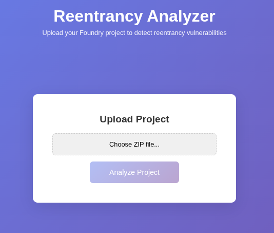
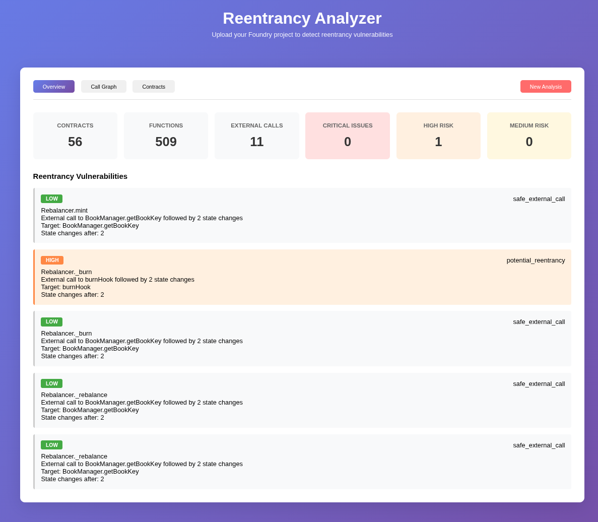
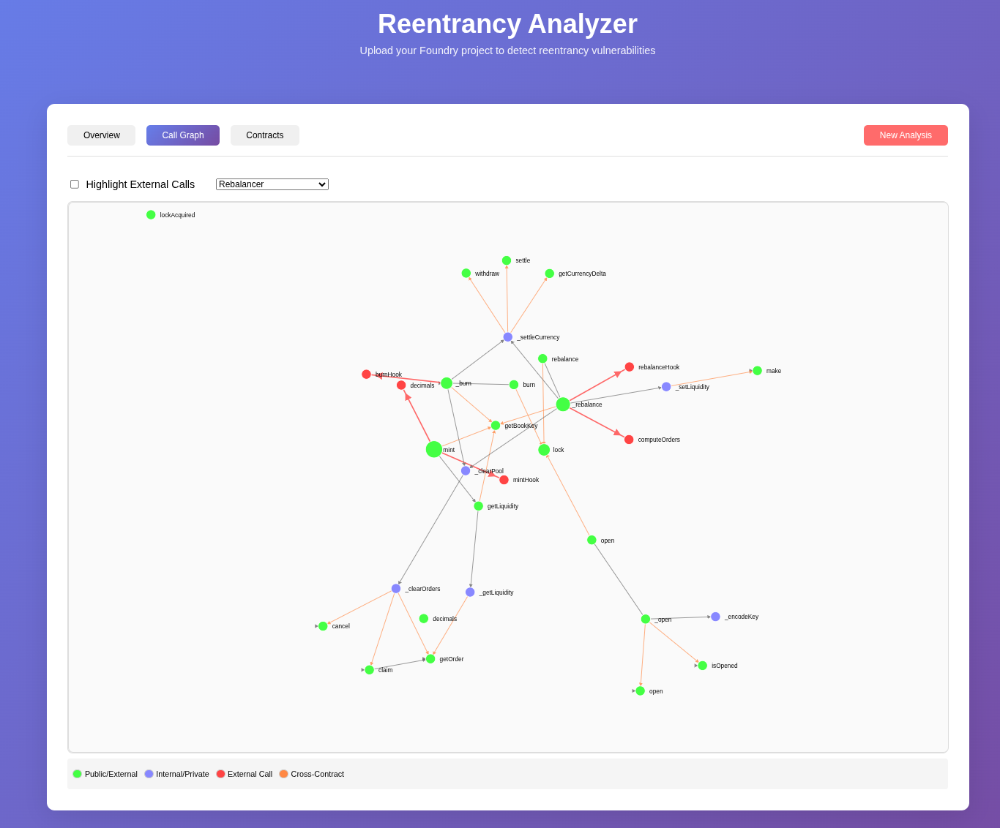
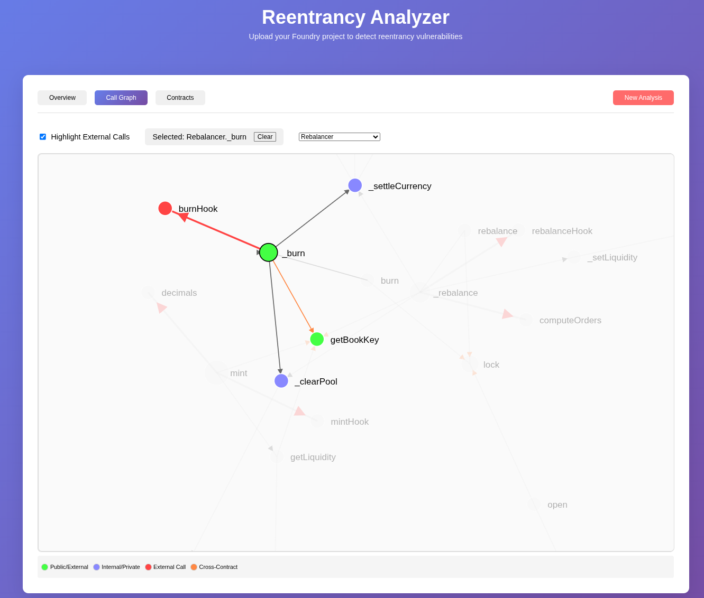

# Reentrancy Analyzer

A static analysis tool for detecting reentrancy vulnerabilities in Solidity smart contracts with cross-contract analysis capabilities and interactive visualization.

## Live Demo

**Try it now: [https://reentrancy-analyzer.veslasoft.com](https://reentrancy-analyzer.veslasoft.com)**

No installation required! The analyzer is deployed and ready to use. Simply upload your Foundry project as a ZIP file, or use the included Clober DEX exploit example at `./dist/clober-exploit.zip`!

<div align="center">

### Upload Interface


*Simple drag-and-drop interface for uploading Foundry projects*

### Analysis Results


*Comprehensive vulnerability report with severity classification*

### Interactive Call Graph


*D3.js-powered interactive visualization of function relationships*



*Click nodes to highlight external call paths and identify vulnerable flows*

</div>

## Real-World Case Study: Clober DEX Exploit

This analyzer includes the **Clober DEX exploit** as a demonstration case. On December 10, 2024, Clober DEX suffered a critical reentrancy attack on the Base network resulting in significant fund losses. The exploit is included in the `contracts/clober-exploit` directory with a full replay test.

### The Clober DEX Incident

**What Happened:**
- An attacker exploited a reentrancy vulnerability in Clober's Rebalancer contract on Base network
- The vulnerability existed in the `burn` function which made an external call to `strategy.burnHook()` before updating pool reserves
- This violated the checks-effects-interactions pattern, allowing the attacker to re-enter and drain funds
- Attack transaction: [0x8fcdfcded45100437ff94801090355f2f689941dca75de9a702e01670f361c04](https://basescan.org/tx/0x8fcdfcded45100437ff94801090355f2f689941dca75de9a702e01670f361c04)

**Attack Flow:**
1. Attacker deployed a malicious strategy contract
2. Called `burn()` which triggered `strategy.burnHook()`
3. In `burnHook()`, re-entered the Rebalancer contract
4. Exploited the outdated reserve values to drain funds

**How This Tool Would Have Prevented It:**
This analyzer would have detected this vulnerability with a **HIGH** severity rating:
- Detects external call to `pool.strategy.burnHook()`
- Identifies state changes to `pool.reserveA` and `pool.reserveB` after the external call
- Flags as potential reentrancy with checks-effects-interactions violation
- Would have prevented the deployment of vulnerable code

### Building the Exploit Test Case

The exploit test case was reconstructed by:
1. **Analyzing the attack transaction** on Base network: [Transaction Details](https://basescan.org/tx/0x8fcdfcded45100437ff94801090355f2f689941dca75de9a702e01670f361c04)
2. **Extracting vulnerable contracts**:
   - [Rebalancer.sol](https://basescan.org/address/0x9092e5f62b27c3eD78feB24A0F2ad6474D26DdA5#code) - The vulnerable contract with the reentrancy issue
   - [BookManager.sol](https://basescan.org/address/0x382CCccbD3b142D7DA063bF68cd0c89634767F76#code) - Core DEX component for comprehensive analysis
3. **Including all dependencies**: Libraries and interfaces for complete static analysis
4. **Creating replay test**: `test/CloberDEX_exp.sol` that demonstrates the exact attack vector

## Features

### Advanced Reentrancy Detection
- **Cross-Contract Analysis**: Analyzes multiple contracts simultaneously to detect inter-contract reentrancy patterns
- **Interface Resolution**: Automatically resolves interface implementations to analyze concrete functions
- **Severity Classification**:
  - **Critical**: Confirmed reentrancy vulnerabilities with callback paths in analyzed contracts
  - **High/Medium**: Potential reentrancy vulnerabilities with possible callback paths in unknown contracts, followed by state changes
  - **Low**: State changes after external calls to analyzed contracts, but with no existing callback paths

### Interactive Visualization
- **Call Graph Visualization**: D3.js-powered interactive graph showing all function relationships
- **Click-to-Explore**: Click any node to highlight its external call paths
- **Real-time Filtering**: Toggle external call highlighting for focused analysis
- **Control Flow Graphs**: Per-function CFG with proper handling of loops and conditionals

### Comprehensive Analysis
- **Inheritance Support**: Properly handles inherited functions and super calls
- **Indirect Call Detection**: Identifies calls made via `abi.encode` and `abi.encodeWithSelector`
- **State Change Tracking**: Monitors all state variable modifications
- **Pattern Recognition**: Detects checks-effects-interactions violations

## Quick Start

### Prerequisites
- Docker
- Node.js 16+ and Yarn
- Git

### Setup Instructions

#### 1. Clone the Repository
```bash
git clone https://github.com/vesla0x1/reentrancy-analyzer.git
cd reentrancy-analyzer
```

#### 2. Environment Variables
To configure the frontend, set up environment variables for the API URL.

**Create** `.env` **files**:

- Copy the example environment file:

 ```bash
 cp frontend/.env.example frontend/.env.development
 ```
- The `.env.example` file contains:

 ```env
 REACT_APP_API_URL=http://localhost:8000
 ```
- For development, edit `frontend/.env.development` to set `REACT_APP_API_URL` to your backend API URL (default: `http://localhost:8000`).
- For production, create `frontend/.env.production` and set `REACT_APP_API_URL` to your production API URL, e.g.:

 ```env
 REACT_APP_API_URL=https://your-production-api.com
 ```

#### 3. Start the Backend
```bash
# Build the Docker image
docker build -t reentrancy-analyzer .

# Run the backend container
docker run -p 8000:8000 -v $(pwd)/temp:/app/temp reentrancy-analyzer

# Or run in background
docker run -d -p 8000:8000 -v $(pwd)/temp:/app/temp --name analyzer-backend reentrancy-analyzer
```

#### 4. Start the Frontend
```bash
# In a new terminal
cd frontend
yarn install
yarn start
```

#### 5. Access the Application
- **Frontend**: http://localhost:3000
- **Backend API**: http://localhost:8000
- **API Documentation**: http://localhost:8000/docs

#### 6. Test with Precompiled Clober Exploit
If you want to try the analyzer immediately without setting up Foundry or installing dependencies, you can use the **precompiled Clober DEX exploit project** included in this repository.

- Location: [`./dist/clober-exploit.zip`](./dist/clober-exploit.zip)
- Contents: Fully prepared Foundry project for the Clober exploit, including all dependencies in `lib/` and a replay test.

## Analyzing the Clober DEX Exploit

The repository includes the actual vulnerable Clober contracts for testing:

### Replay the Exploit (Optional)
```bash
# Navigate to the exploit directory
cd contracts/clober-exploit

# Install dependencies (if not already installed)
forge install

# Run the exploit replay test
forge test --match-contract CloberDEX_exp -vvv
```

## Preparing Your Own Foundry Project

### Project Structure Required
```
your-project/
├── foundry.toml          # Foundry configuration
├── src/                  # Contract sources
│   ├── YourContract.sol
│   └── interfaces/
├── lib/                  # Dependencies (MUST be included!)
│   ├── openzeppelin-contracts/
│   ├── solmate/
│   └── other-dependencies/
└── test/                 # Tests (optional for analysis)
```

### Creating the ZIP File

#### Option 1: Using the prepare script
```bash
./scripts/prepare-project.sh path/to/your-project
```

#### Option 2: Manual ZIP creation
```bash
cd your-foundry-project

# Install dependencies first
forge install

# Verify it compiles
forge build

# Create ZIP with lib directory included
zip -r project.zip . \
  -x "*.git*" \
  -x "*cache*" \
  -x "*out*" \
  -x "*node_modules*" \
  -x "*.env*"
```

**Important**: The `lib` directory MUST be included in the ZIP file as it contains the dependencies needed for proper analysis and interface resolution.

## How to Use

### 1. Upload Project
1. Open http://localhost:3000 in your browser
2. Click "Choose ZIP file" and select your project ZIP (try `clober-exploit.zip` first!)
3. Click "Analyze Project"

### 2. Analysis Process
The system will:
1. Extract and validate your project
2. Run `crytic-compile` to generate the complete AST
3. Analyze all contracts for reentrancy patterns
4. Perform cross-contract analysis
5. Generate interactive visualizations

### 3. Explore Results

#### Overview Tab
- **Summary Statistics**: Total contracts, functions, external calls
- **Vulnerability Report**: Categorized by severity
- **Clober Example**: Will show HIGH vulnerability in `Rebalancer._burn`

#### Call Graph Tab
- **Interactive Graph**: Visualize the entire call flow
- **Node Colors**:
  - 🟢 Green: Public/External functions (entry points)
  - 🔵 Blue: Internal/Private functions
  - 🔴 Red: External call targets (like `strategy.burnHook`)
  - 🟠 Orange: Cross-contract calls
- **Click to Explore**: Click on `Rebalancer._burn` to see the vulnerable path

#### Contracts Tab
- Browse all contracts including `Rebalancer`, `IStrategy`
- View function details and inheritance relationships

## Architecture

```
┌─────────────────┐     ┌─────────────────┐     ┌─────────────────┐
│  React Frontend │────▶│   FastAPI       │────▶│    Analyzer     │
│  (TypeScript)   │     │   Backend       │     │     Engine      │
│     + D3.js     │     │   (Python)      │     │                 │
└─────────────────┘     └─────────────────┘     └─────────────────┘
                               │                         │
                               ▼                         ▼
                        ┌─────────────┐         ┌─────────────┐
                        │   Crytic    │         │   NetworkX  │
                        │   Compile   │         │    Graphs   │
                        └─────────────┘         └─────────────┘
```

## Project Structure

```
reentrancy-analyzer/
├── backend/
│   ├── server.py                # FastAPI server
│   ├── analyzer.py              # Core analysis engine
│   └── requirements.txt         # Python dependencies
├── frontend/
│   ├── src/
│   │   ├── App.tsx              # Main React component
│   │   ├── CallGraph.tsx        # D3.js graph visualization component
│   │   └── App.css              # Styles
│   ├── package.json             # Node dependencies
│   └── tsconfig.json            # TypeScript config
├── contracts/
│   └── clober-exploit/          # Clober DEX vulnerable contracts
│       ├── foundry.toml
│       ├── remappings.txt
│       ├── src/
│       │   ├── Rebalancer.sol      # Vulnerable contract (reentrancy in _burn)
│       │   ├── BookManager.sol     # Core DEX component
│       │   ├── interfaces/
│       │   │   ├── IBookManager.sol
│       │   │   ├── IRebalancer.sol
│       │   │   ├── IStrategy.sol   # Interface for external calls
│       │   │   ├── ILocker.sol
│       │   │   ├── IHooks.sol
│       │   │   ├── IERC721Permit.sol
│       │   │   └── ...
│       │   └── libraries/
│       │       ├── BookId.sol
│       │       ├── Book.sol
│       │       ├── Currency.sol
│       │       ├── ERC6909Supply.sol
│       │       ├── FeePolicy.sol
│       │       ├── OrderId.sol
│       │       ├── Tick.sol
│       │       └── ... (other library files)
│       ├── test/
│       │   ├── CloberDEX_exp.sol   # Exploit replay test
│       │   ├── basetest.sol        # Test utilities
│       │   ├── interface.sol       # Test interfaces
│       │   └── tokenhelper.sol     # Token helpers for testing
│       └── lib/                     # Dependencies (Foundry libraries)
├── scripts/
│   └── prepare-project.sh      # Helper script for ZIP creation
├── temp/                        # Temporary files (auto-created)
├── Dockerfile                   # Container definition
├── .gitignore
└── README.md                    # This file
```

## Troubleshooting

### Port Already in Use
```bash
# Use a different port
docker run -p 8001:8000 reentrancy-analyzer

# Update frontend to use the new port
# In frontend/src/App.tsx, change:
const API_URL = 'http://localhost:8001';
```

### Analysis Fails
- Ensure ZIP includes the `lib` directory
- Verify project compiles: `forge build`
- Check Docker logs: `docker logs analyzer-backend`

### Docker Issues
```bash
# Clean up everything
docker stop analyzer-backend
docker rm analyzer-backend
docker rmi reentrancy-analyzer

# Rebuild fresh
docker build -t reentrancy-analyzer .
```

### Frontend Issues
```bash
# Clear cache and reinstall
cd frontend
rm -rf node_modules yarn.lock
yarn install
yarn start
```

## 📚 References

- [Clober DEX Incident Analysis](https://rekt.news/cloberdex-rekt)
- [Base Network Attack Transaction](https://basescan.org/tx/0x8fcdfcded45100437ff94801090355f2f689941dca75de9a702e01670f361c04)
- [Vulnerable Rebalancer Contract](https://basescan.org/address/0x9092e5f62b27c3eD78feB24A0F2ad6474D26DdA5#code)
- [BookManager Contract](https://basescan.org/address/0x382CCccbD3b142D7DA063bF68cd0c89634767F76#code)
- [Reentrancy Vulnerability Patterns](https://rareskills.io/post/where-to-find-solidity-reentrancy-attacks)
- [Checks-Effects-Interactions Pattern](https://docs.soliditylang.org/en/latest/security-considerations.html#reentrancy)

## ⚠️ Disclaimer

This tool is for educational and development purposes. While it can detect many reentrancy patterns, it should not be the only security measure. Always conduct thorough audits before deploying contracts to production.

---

**Remember**: The Clober DEX exploit could have been prevented with proper static analysis. Use this tool to ensure your contracts don't suffer the same fate!
